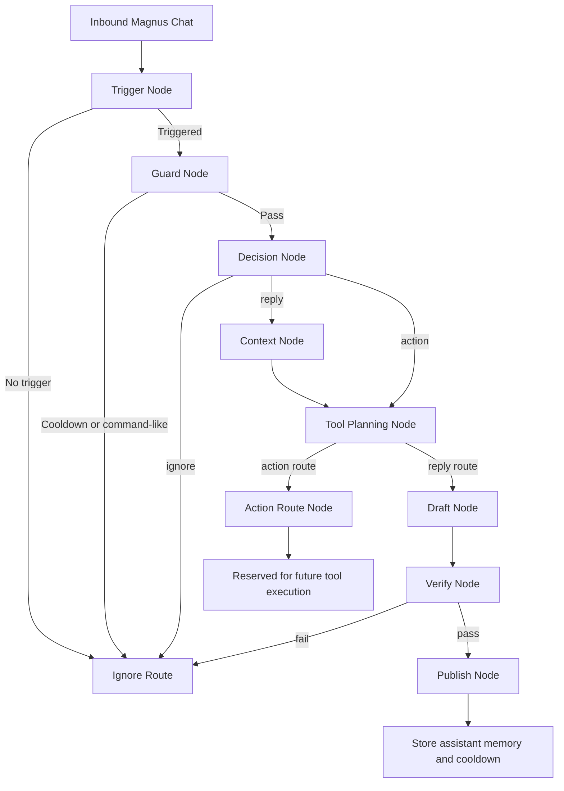

# Chat Pipeline Flow

The runtime now uses an ordered multi-node chat pipeline instead of a single hardcoded `trigger -> respond` path.

## Routes
- `ignore`: stop early without generating chat
- `reply`: generate and publish a persona message
- `action`: reserve the request for future tool/action execution

## Flowchart

## Current Notes
- `TriggerNode` still uses the existing trigger heuristics from `TriggerEngine`.
- `GuardNode` handles deterministic skips before any LLM call.
- `ContextNode` builds structured context from chat memory and Magnus player-list heartbeats.
- `ToolPlanningNode` exposes action candidates when persona actions are enabled.
- `ActionRouteNode` is currently a stubbed alternate route so the pipeline can grow without another architecture rewrite.
